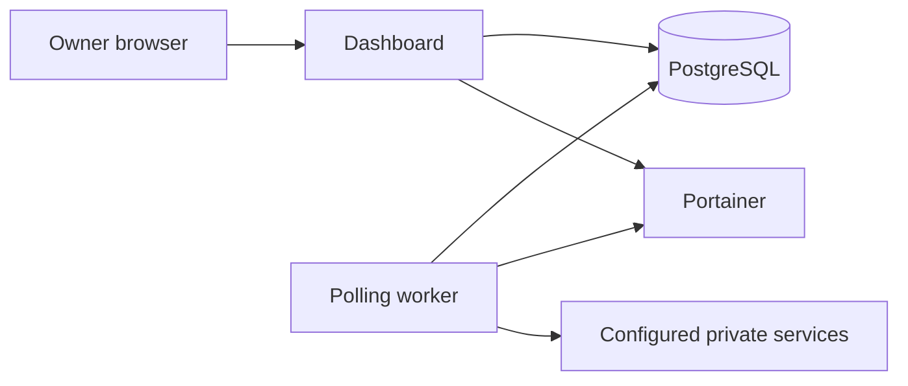

Dashbored uses a small, deliberate architecture so it can run continuously without a large resource footprint.

## Dashboard

The Next.js dashboard authenticates the owner, reads persisted health data, renders service-specific UI, and submits confirmed actions. It does not continuously fan out to every upstream service from a browser request.

## Worker

The worker runs separately from the web process. On each sweep, it acquires a PostgreSQL advisory lock, checks due enabled services with bounded concurrency, persists a compact health result, and runs Portainer discovery when due. The lock means only one worker performs a sweep when more than one instance is accidentally or intentionally started.

The worker uses short timeouts, jitter, and exponential backoff to limit impact on both the host and unavailable services.

## Database

PostgreSQL is the source of truth for:

- owner accounts and sessions;
- service categories and connections;
- encrypted service credentials;
- compact health snapshots and history;
- Launcher discovery records and user overrides;
- confirmed action audit events and user preferences.

The database is internal to the Compose stack by default. Its volume is the stateful part that requires backups.

## Adapters

Adapters implement a typed contract for connection testing, health, summary data, optional discovery, available actions, and action execution. They validate upstream response shapes and normalize timeouts, authorization failures, rate limits, offline services, and incompatible versions into predictable connection states.

An adapter runs server-side. Its credentials and raw authenticated responses are never sent to the browser.

## Why Portainer instead of the Docker socket?

Mounting a Docker socket into a dashboard container effectively grants broad host control. Dashbored avoids this high-risk trust boundary. Portainer provides a narrower, auditable API token boundary for inventory and permitted actions.

## Data retention

Health snapshots are designed for operational trends, not long-term observability. Dashbored writes compact heartbeats for stable services and prunes old records. For high-cardinality logs, traces, or long-term metrics, keep using a purpose-built monitoring system and link to it through Launcher.
